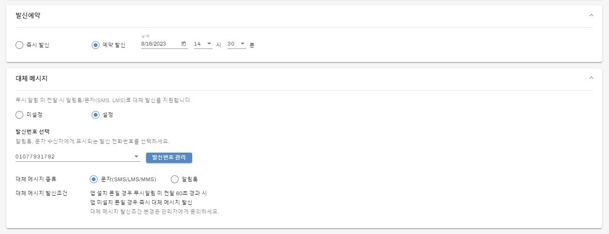

# 웹 관리자 

## 목차

- [계정 가입](#계정-가입)
- [메시지 발신](#메시지-발신)
- [발신대상 관리](#발신대상-관리)
- [템플릿 관리](#템플릿-관리)
- [푸시앱 인증서 설정](#푸시앱-인증서-설정)

## 계정 가입

- 브라우저로 UMS 웹 관리자 접속

- E-mail, Name, Company, Password를 입력 후 'CREATE ACCOUNT'버튼 클릭
- 30분 이내에 이메일 인증 수행해야 한다.

- 입력한 메일 주소로 인증 메일이 발송된다.
- 수신 이메일에서 '이메일 인증' 링크 클릭을 통해 가입을 완료한다.

## 발신번호 등록

- 래셔널UMS는 푸시알림 미전달 사용자에게 대체문자(SMS/LMS/MMS, 알림톡)를 자동 발신 지원한다.
- 푸시알림만 이용할 경우는 할 필요가 없으나 SMS/LMS/MMS, 알림톡 발신을 이용 할 경우 발신번호 등록 과정이 필요하다.
- '발신번호 관리 > 발신번호 등록'을 클릭한다.
- 등록할 발신번호, pdf 포맷의 통신가입증명원(필수), pdf 포맷의 재직증명서(옵션)을 입력 및 업로드한다.
- '발신번호 등록 요청' 버튼을 클릭한다.
- 등록 요청한 발신번호는 하루 이내의 검증과정을 거쳐 문제가 없을 경우 등록 승인이 된다.
- 등록 승인된 발신 번호를 통해 문자(SMS/LMS/MMS), 알림톡 발신을 이용할 수 있다.

## 메시지 발신

- UMS 웹 관리자 로그인 > 메시지 발신 클릭

- 메시지 내용, 발신대상 지정은 필수 입력 필드이다.

### 발신대상 선택

1. 사용자 그룹에서 선택 
 - 사용자 그룹은 푸시앱 설치와 무관하게 대상 선택이 가능하다.
 - 사용자 그룹은 '발신대상 관리'에서 편집 및 관리
 - 자주 발신하는 대상을 사용자 그룹으로 관리

2. 전화번호 직접 입력
 - 푸시앱 설치와 무관하게 대상 선택이 가능하다.
 - 전화번호로 발신대상 지정하는 방식

3. 푸시앱 검색
 - 푸시앱 설치 사용자를 검색하여 메시지 발신대상 지정하는 방식
 - 전화번호, 이름, 앱유저 아이디로 대상을 검색하여 선택

 

4. 푸시앱 사용자 전체
 - 푸시앱 설치한 사용자 전체를 발신대상으로 지정하는 방식

### 발신예약

특정 날짜의 특정 시간에 메시지 발신하고자 할 때 예약 발신을 통해 시간을 지정한다.

### 대체 메시지

대체 메시지 설정은 문자(SMS/LMS/MMS)와 알림톡을 발신시 설정한다.

1. 푸시앱 미설치 폰에 문자와 알림톡을 발신할 경우
2. 푸시앱 설치 폰에 푸시 메시지 발신 후 푸시 미전달시 문자나 알림톡으로 전환 발신할 경우

 

### 발신번호 선택

- 발신번호는 문자와 알림톡 발신시 지정해야 하는 전화번호이다.
- 발신번호는 통신사에서 관리를 하고 있으며 로그인한 이메일 계정으로 기존 등록한 이력이 있으면 등록한 발신번호를 자동 표시한다.
- 만약 로그인 이메일계정으로 기존 등록한 발신 번호가 없을 경우 '발신번호 관리'버튼을 클릭하여 발신번호를 등록하면 된다.

### 대체메시지 종류

- 푸시 미 전달 사용자나 푸시앱 미설치 사용자에게 전달할 대체 메시지 종류
1. 문자(SMS/LMS/MMS)
 - 이미지가 첨부되면 MMS로 발신하고, 제목을 입력하거나 본문이 90바이트 초과시 LMS로 발신, 그렇지 않으면 SMS로 자동 발신한다.
2. 알림톡
 - 알림톡 발신을 위해서는 '템플릿 불러오기'버튼을 클릭해서 템플릿을 로드해야 한다.
 - 알림톡 미전달시 문자로 대체 발신하기 위해서는 '알림톡 미전달시 문자 대체 발신' 체크박스를 선택한다.

 

 ### 대체메시지 발신조건

- 앱 미설치 폰일 경우에는 즉시 대체 메시지가 발신
- 앱 설치 폰일 경우 푸시알림 미전달 60초(디폴트) 경과시 대체 메시지 발신됨
- 알림톡 미전달시 문자 전환 발신은 알림톡 미전달 60초(디폴트) 경과시 문자 발신됨
- 대체메시지 발신조건 시간을 변경하기 위해서는 별도의 설정파일인 'ums_properties.dat' 파일에 접근 가능한
관리자에게 변경 요청을 통해 아래 값을 원하는 값으로 변경 요청한다.
- wait_time_push_to_alternative = 60
- wait_time_alimtalk_to_munja = 120

## 발신대상 관리

- 사용자그룹은 회사 조직도와 같이 자주 발신하는 대상을 그룹으로 만들어 두고 메시지 발신시 대상을 쉽게 선택할 수 있다.
- 그룹추가, 그룹삭제, 그룹명변경, 그룹이동을 클릭하여 사용자 그룹을 원하는대로 조직한다.

### 사용자 그룹 구성원 관리

- 사용자 그룹을 클릭하면 해당 사용자 그룹에 추가된 구성원 목록이 오른쪽 테이블로 표시된다.
- 구성원 화면의 '추가', '삭제', '구성원전체 삭제' 를 통해 구성원의 추가 삭제할 수 있다.

### 사용자 그룹 구성원 관리
- '엑셀 일괄 추가/수정/삭제'를 클릭하면 아래 팝업이 나타난다.

- '1. 사용자그룹 구성원 파일 다운로드' 버튼을 클릭하여 현재 구성원 정보가 포함된 엑셀을 다운로드한다.
- 엑셀파일에 구성원을 추가/수정/삭제 일괄 작업 후 '2. 엑셀파일 업로드' 버튼을 클릭하면 구성원 정보가 일괄 반영된다.

## 템플릿 관리

템플릿은 정형화된 메시지 내용 형태를 만들어 두고 변수만 세팅하여 메시지를 발신할 수 있게 한다.

- 템플릿은 푸시메시지, 문자(SMS/LMS/MMS), 알림톡에 모두 활용 가능하다.
- 템플릿 관리를 클릭하면 등록한 템플릿 목록이 표시된다.
- 알림톡을 발신하기 위해서는 템플릿을 등록시 알림톡 연동을 설정해야 한다.

### 템플릿 등록

- 템플릿 관리 > 템플릿 등록 버튼 클릭
- 템플릿 이름, 템플릿 내용은 필수 입력 필드
- 이미지 첨부, 알림톡 연동은 옵션

### 템플릿 알림톡 연동

- 알림톡을 발신하기 위해서는 알림톡 연동된 템플릿이 존재해야 한다.
- 알림톡 연동된 템플릿은 템플릿 등록시 알림톡 연동을 체크한다.
- 템플릿을 연동할 카카오톡 채널을 선택한다.
- 선택할 카카오 채널이 표시되지 않은 경우 '카카오톡 채널 관리' 버튼을 클릭하여 카카오톡 채널을 연동한다.

### 카카오톡 채널 관리

- '카카오톡 채널 관리'를 클릭하면 관리팝업이 나타난다.
- 이용할 카카오톡 채널은 '+카카오톡채널연동'버튼을 클릭하여 추가할 수 있다.
- 연동추가된 카카오톡 채널은 연동할 카카오톡 채널 목록에 표시되고 선택할 수 있다.

## 푸시앱 인증서 설정

- 문자(SMS/LMS/MMS)나 알림톡만 이용할 경우 푸시앱 인증서를 설정할 필요가 없다. 
- 푸시앱을 만들어 푸시앱 대상 푸시 메시지를 발신하려면 IOS 및 안드로이드 폰 발신을 위한 인증서를 설정해야 푸시 메시지가 전달된다.
- 푸시앱 인증서 설정은 푸시앱 개발단계에서 설정하고 앱스토어 배포시 IOS 의 경우 배포방식을 개발용에서 앱스토어 배포용으로 변경한다.

### IOS 용 인증서 설정

- OVERVIEW 를 클릭하여 'APNS 등록' 버튼을 클릭
- p8 인증키 방식과 p12 인증서 방식 중 원하는 방식으로 선택할 수 있다.
- p12 인증서 방식으로 설정할 경우 매년 갱신해야 하는 번거로움이 있고 미갱신시 푸시알림이 전달되지 않는 불상사가 발생한다.
- p8 인증키 방식을 권고

1. p8 인증키 방식

- 앱개발시 발급한 p8 인증키를 업로드한다.
- 배포방식을 선택한다. 개발 단계일 경우 개발용으로 앱스토어 배포 시 '앱스토어 배포용'으로 변경해야 한다.
- 애플개발자 계정에서 푸시앱을 번들아이디, 키아이디, 팀아이디를 입력 후 '업로드' 버튼을 클릭

2.  p12 인증서 방식

- 앱개발시 발급한 p12 인증서를 업로드한다.
- 배포방식을 선택한다. 개발 단계일 경우 개발용으로 앱스토어 배포 시 '앱스토어 배포용'으로 변경해야 한다.
- 애플개발자 계정에서 푸시앱을 번들아이디와 p12 인증서의 비밀번호를 입력 후 '업로드' 버튼을 클릭

### 안드로이드 용 인증서 설정

- OVERVIEW 를 클릭하여 'FCM 서버키 등록' 버튼을 클릭
- 안드로이드 푸시앱 개발시 파이어베이스 콘솔에서 등록한 프로젝트 ID와 서버키를 업로드 후 '업로드'버튼 클릭

